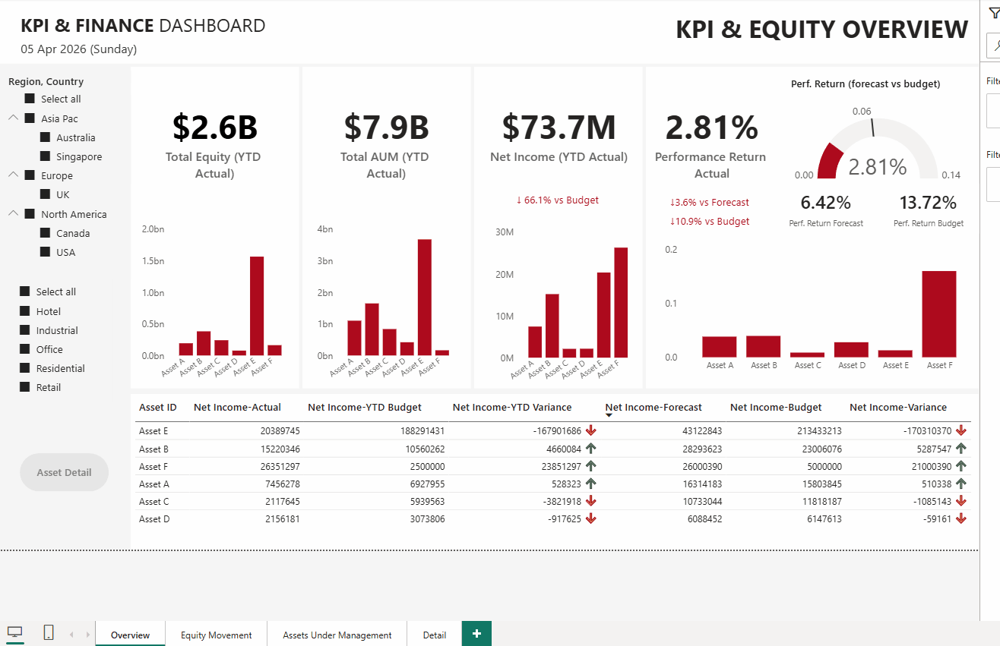

# KPI & Finance Dashboard

A multi-page financial dashboard built in Power BI for a real estate investment portfolio, covering KPI tracking, equity analysis, and asset-level income statement reporting.

## Dashboard Pages
- **KPI & Equity Overview** — Total Equity, AUM, Net Income, Performance Return vs Budget
- **Assets Under Management** — AUM breakdown by category and asset, real estate value weighting by sector
- **Equity Movement** — Waterfall chart showing material equity movements across attribution categories
- **Asset Detail** — Drill-through page with full income statement per asset (Actual vs Budget vs Forecast)

## Features
- DAX measures for Performance Return (Net Income ÷ Equity)
- Drill-through navigation from overview to asset-level detail
- Region, Country, and Sector slicers with cross-filtering
- Variance indicators with conditional formatting

## Demo

## Tech Stack
- Power BI Desktop
- DAX
- Data Modelling